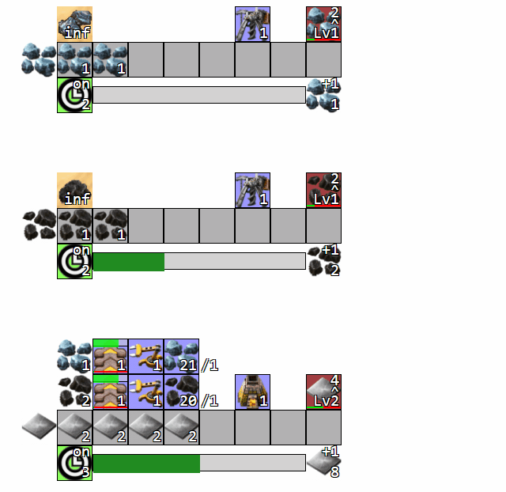
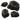
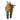
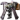
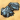
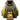

# Idle Factorio

Welcome to Idle Factorio! This is a fangame inspired by the factory management video game <a href="http://www.factorio.com" target="_blank">Factorio</a>.
 
 

 
 
<a href="https://idlefactorio.azurewebsites.net">Play the game here</a>
 
 
How to play:
<ul>
	<li>Get resources by clicking on the  clock symbol (you can click on several  clocks at the same time).</li>            
	<li>Transfer   resources on a  fire camp or  hand assembling to fuse resources together.</li>
	<li>Use  drills to automate  ore mining,  furnaces to automate  smelting, and  assembling machines to automate  hand assembling.</li>
	<li>Use  Transport Belts to automate resource transfer.</li>
	<li>Use  Inserters to transfer more resources with each click and each Transport Belt.</li>
	<li>Choose wisely when to spend resources to create tools, and when to spare resources for later!</li>
	<li>(the game has currently no save system, so you should avoid to close the tab)</li>
</ul>

Share the game on Reddit, Facebook, Twitter, and everywhere else!

Idle Factorio is a game made by 
 Marc Kruzik
( <a href="https://www.linkedin.com/in/marckruzik" target="_blank">LinkedIn</a>, 
 <a href="https://twitter.com/MarcKruzik" target="_blank">Twitter</a>,  
 <a href="http://www.marckruzik.fr" target="_blank">Website</a>), 
using 100%  Blazor (no JavaScript, no CSS animations). 
You can get the source code on  <a href="https://github.com/marckruzik/Idle_Factorio" target="_blank">GitHub</a>.

Have fun!

